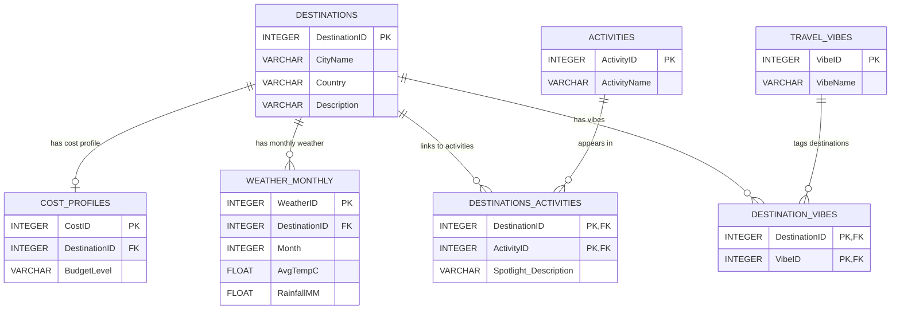

## DREAMROUTE_
The app of tomorrow, today! Have you ever spent a lot of time scouring the internet for the perfect holiday destination? Look no further; the DREAMROUTE_ app will help you find your dream holiday destination! The only thing you have to do is answer five simple questions, and you'll have three options to choose from.

## Project Description
This project is part of a class assignment for the Full-Stack Development module. The resulting app is the creation of hard work from Dylan Moffet, Nicusor Ghinea, and Theo Bailey. We used Astro as the main framework for the project, React for the frontend, Python with SQL to develop the database, and finally, Python with Flask to create our own API that communicates directly with our Astro project.

The following readme has the following sections:
1) Project Structure
2) How to run and use the app
3) Data base visualiation
4) References

## Project Structure

```text
.
├── apiserver/                  # Python backend API (Flask)
│   ├── notebooks/              # Utility and testing notebooks
│   ├── server.py               # Main Flask API entry point
│   └── test_api_connection.py  # Health check script for endpoints
├── apiviewer/                  # Astro frontend application
│   ├── public/                 # Static assets
│   └── src/                    # Frontend source code
├── report/                     # Project documentation and evidence
│   ├── photo_evidences/        # Supporting images
│   └── video/                  # Video demonstrations
└── setup/                      # Database schema and population logic
    ├── notebooks/              # Utility and testing notebooks
    ├── db_populate.py          # Script to seed the database via APIs
    ├── setup.py                # Script to initialize database tables
    └── travel_planner.db       # SQLite database file
```
## How to run and use the app

To run this application, you will firstly need to install all the dependency then you'll use two separate terminal windows/tabs to run the project.
1. Install dependencies
You need to be in the main directory, while there run this command in the terminal:

```text
pip3 install -r requirements.txt    # Installs all the libraries for python, such as sqlalchemy
```

2. Frontend Setup (Terminal 1 - Root Directory)
Navigate to the root directory where the main package.json is and run the following commands:

```text
npm install	                # Installs all frontend dependencies
npm run dev	                # Starts the local dev server at http://localhost:4321
```
3. Backend Setup (Terminal 2 - apiserver Directory)
Navigate into the apiserver/ folder and run this commands:

```text
pip3 install -r requirements.txt	# Installs all necessary Python libraries
python3 server.py	                # Starts the Python API at http://localhost:5001
```

4. Database
If you need to reset or populate the database, use the scripts located in the setup/ folder and run the following commands:

```text
python3 setup/setup.py              # Create tables
python3 setup/db_populate.py        # Populate the db
```

After you have done all of the above, open your favourite browser and go to the localhost:4321, or the specific localhost from your console to navigate our website.

## Database Visualisation Table
Our database is formed of 7 tables. The main table, "Destinations", stores core city details. To store other relevant data, we are using the "Cost_Profiles", "Weather_Monthly", "Activities", and "Travel_Vibes" tables to provide specific, individual data. Finally, we use two junction tables, "Destination_Vibes" and "Destination_Activities", which contain the foreign keys needed to efficiently connect and map this data together.



## References

## References & Technologies

| Category | Resource | Purpose |
| :--- | :--- | :--- |
| **Frontend** | [Astro](https://astro.build/) & [React](https://react.dev/) | Framework and component architecture |
| **Backend** | [Flask](https://flask.palletsprojects.com/) | Python API framework |
| **Database** | [SQLAlchemy](https://www.sqlalchemy.org/) & [SQLite](https://www.sqlite.org/) | ORM and relational storage |
| **Data (Geo)**| [Open-Meteo Geocoding API](https://open-meteo.com/) | City coordinates and population data |
| **Data (Climate)**| [Open-Meteo Archive API](https://open-meteo.com/) | Historical temperature and rainfall data |
| **Data (Info)** | [Wikipedia REST API](https://en.wikipedia.org/api/rest_v1/) | Automated city descriptions |
| **Data Reading** | [JSON](https://www.json.org/) | Data exchange specifications |
| **Design** | [MDN CSS Guide](https://developer.mozilla.org/en-US/docs/Web/CSS/Guides/Grid_layout) | CSS Grid layouts |


## Licence

This project is licensed for educational use and not to be used as a product that can generate revenue.