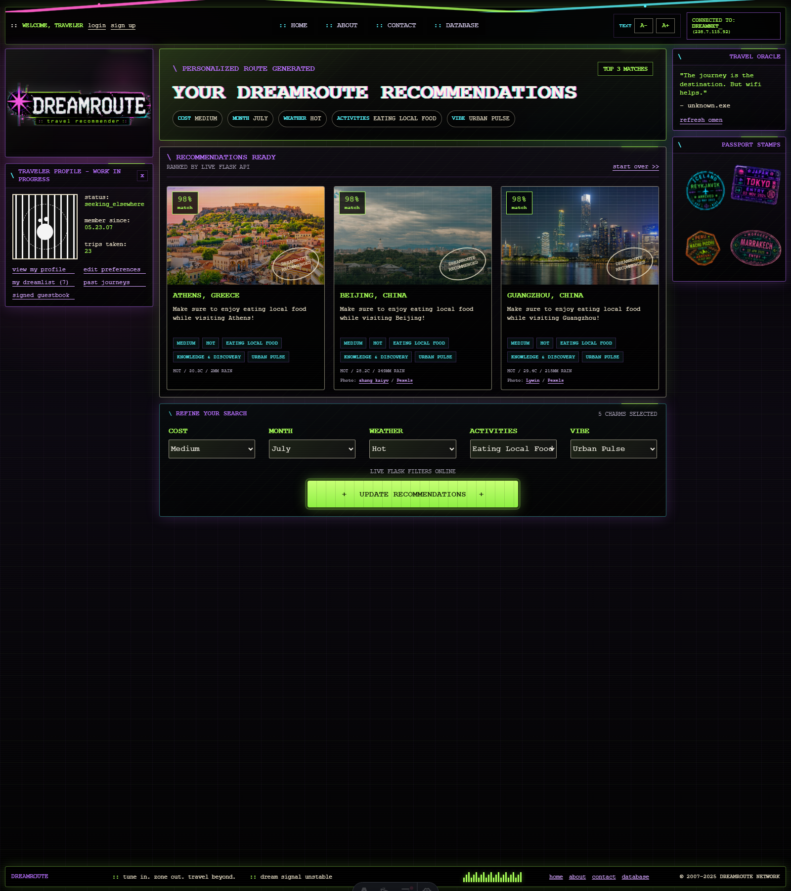
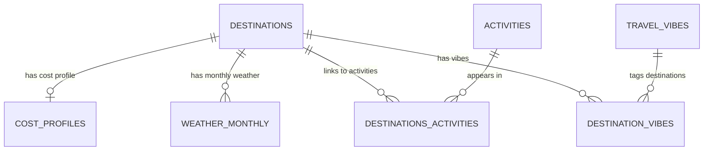

# Dreamroute

> **Internship-winning full-stack project** — a Flask-powered travel recommendation website for people who want more character from their trip planning.

Dreamroute is a full-stack travel recommender that turns personal preferences into three ranked destination suggestions. Built with Astro, React, custom CSS, Flask, SQLAlchemy, and SQLite, it pairs a familiar travel-search workflow with a deliberately nostalgic Myspace-inspired interface and cyberpunk visual language.

Rather than imitate the polished minimalism of typical travel sites, Dreamroute embraces the energy of the early internet: glitch effects, neon graphics, dense panels, and retro 90s references. The goal is to make travel discovery feel personal and memorable for a tech-oriented audience that is tired of corporate, interchangeable booking experiences—without sacrificing usability. Familiar patterns from Booking.com, Expedia, and Kayak, including filter controls, a clear call to action, and focused recommendation panels, keep the experience intuitive.



*Dreamroute’s cyberpunk recommendation interface: three ranked matches, visible filter choices, and destination-level travel data.*

## How it works

1. The traveller chooses preferences for **cost**, **month**, **weather**, **activity**, and **vibe**.
2. Selecting **Find My Destination** sends those choices to the Flask API.
3. The API queries the SQLite travel dataset, scores each destination against the selected filters, and returns the highest-ranked matches.
4. Astro and React render three recommendation panels with the match score and useful context, including cost, weather, local activity, and vibe.

The recommendation score reflects how closely a destination matches the chosen filters, making it easy to compare options at a glance rather than browse an undifferentiated list.

## Product and design rationale

Dreamroute was designed as a disruption of the clean, minimalist travel website. Its Myspace-inspired layout and cyberpunk/glitch artwork are intentionally expressive, evoking early-internet nostalgia while preserving the interaction patterns users already understand. The result is a practical search tool with a visual identity that does not look—or feel—like a standard travel page.

## Built with

| Area | Technology | Purpose |
| --- | --- | --- |
| Frontend | [Astro](https://astro.build/), [React](https://react.dev/), custom CSS | Interactive interface, filtering flow, and responsive recommendation panels |
| Backend | [Flask](https://flask.palletsprojects.com/) | REST API that filters, ranks, and returns destination recommendations |
| Data | [SQLAlchemy](https://www.sqlalchemy.org/), [SQLite](https://www.sqlite.org/) | Relational storage for destinations, cost, weather, activities, and vibes |
| Data sources | [Open-Meteo](https://open-meteo.com/) and [Wikipedia REST API](https://en.wikipedia.org/api/rest_v1/) | Destination, geographic, climate, and descriptive information |

## Team and individual ownership

This was a collaborative project. The responsibilities below identify each contributor’s primary areas of ownership; planning, integration, and review were shared across the team.

| Contributor | Primary ownership |
| --- | --- |
| **Dylan Moffett** | Frontend experience and product presentation: developed and iterated the Myspace/cyberpunk interface, implemented the Astro/React recommendation flow and filters, integrated destination imagery, and refined the search, accessibility, documentation, and final project presentation. |
| **Nicusor Ghinea** | Backend and data foundation: developed the Flask API and its test tooling, built and maintained the SQLite data layer, and supported database setup, population, validation, and project structure. |
| **Theo Bailey** | Destination-card imagery: contributed image support for the React destination cards. |

## Project structure

```text
.
├── apiserver/                  # Flask API and endpoint checks
├── apiviewer/                  # Astro + React frontend
│   ├── public/                 # Static UI and destination assets
│   └── src/                    # Pages, components, and custom styles
├── setup/                      # SQLite schema, data population, and image tools
└── report/                     # Project report, video, and visual evidence
```

## Run locally

### Prerequisites

- Python 3
- Node.js and npm

### 1. Install Python dependencies

From the project root:

```bash
pip install -r requirements.txt
```

### 2. Create and populate the database

```bash
python setup/setup.py
python setup/db_populate.py
```

### 3. Start the Flask API

In one terminal:

```bash
python apiserver/server.py
```

The API runs at `http://127.0.0.1:5001`.

### 4. Start the Astro frontend

In a second terminal:

```bash
cd apiviewer
npm install
npm run dev
```

Open `http://localhost:4321` in a browser.

### 5. Optional: check the API

With the Flask server running:

```bash
python apiserver/test_api_connection.py
```

## Data model

The SQLite database relates destinations to cost profiles, monthly weather, activities, and travel vibes. Junction tables connect destinations to their activities and vibe tags, allowing the API to evaluate all five traveller preferences when ranking recommendations.



## Licence

This project is provided for educational and portfolio purposes and is not intended for commercial use.
