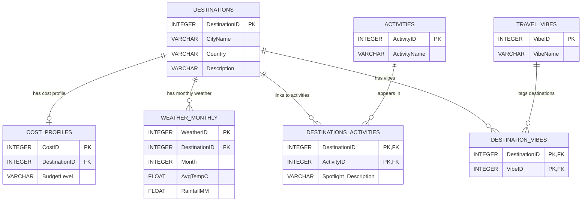

# DREAMROUTE Database Schema

```mermaid
erDiagram
    DESTINATIONS {
        INTEGER DestinationID PK
        VARCHAR CityName
        VARCHAR Country
        VARCHAR Description
    }

    COST_PROFILES {
        INTEGER CostID PK
        INTEGER DestinationID FK
        VARCHAR BudgetLevel
    }

    WEATHER_MONTHLY {
        INTEGER WeatherID PK
        INTEGER DestinationID FK
        INTEGER Month
        FLOAT AvgTempC
        FLOAT RainfallMM
    }

    ACTIVITIES {
        INTEGER ActivityID PK
        VARCHAR ActivityName
    }

    DESTINATIONS_ACTIVITIES {
        INTEGER DestinationID PK, FK
        INTEGER ActivityID PK, FK
        VARCHAR Spotlight_Description
    }

    TRAVEL_VIBES {
        INTEGER VibeID PK
        VARCHAR VibeName
    }

    DESTINATION_VIBES {
        INTEGER DestinationID PK, FK
        INTEGER VibeID PK, FK
    }

    DESTINATIONS ||--o| COST_PROFILES : "has cost profile"
    DESTINATIONS ||--o{ WEATHER_MONTHLY : "has monthly weather"
    DESTINATIONS ||--o{ DESTINATIONS_ACTIVITIES : "links to activities"
    ACTIVITIES ||--o{ DESTINATIONS_ACTIVITIES : "appears in"
    DESTINATIONS ||--o{ DESTINATION_VIBES : "has vibes"
    TRAVEL_VIBES ||--o{ DESTINATION_VIBES : "tags destinations"
```
